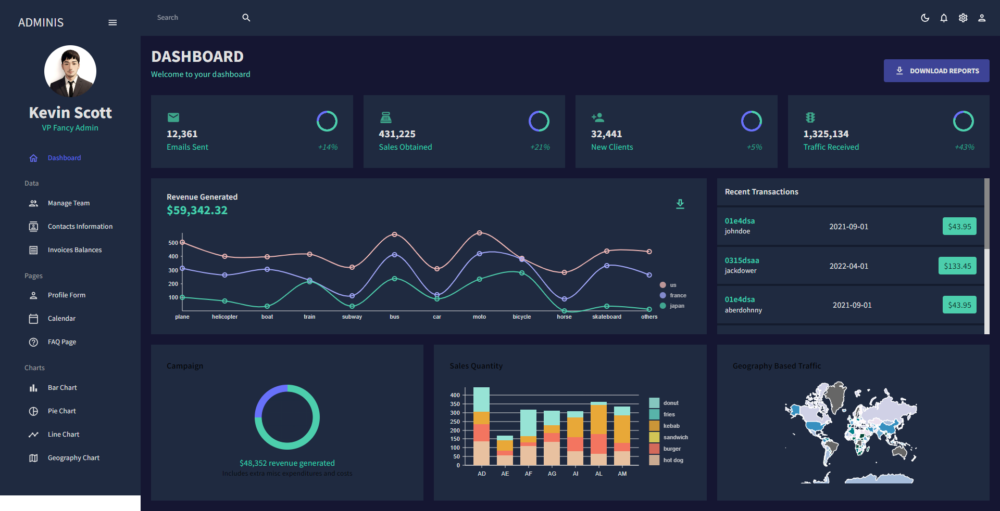

# react-vite-eslint-prettier-husky-template


> Template for React JS projects + Vite

## Try it

### Clone to local

```bash
git clone https://github.com/adonisman710/admin-dashboard-pro.git
cd my-app
yarn install # If you don't have yarn installed, run: npm install -g yarn
```

## Usage

### Development

```bash
yarn dev
```

### Build

```bash
yarn build
```

And you will see the generated file in `dist` that ready to be served.

### Serve dist

```bash
yarn serve
```
